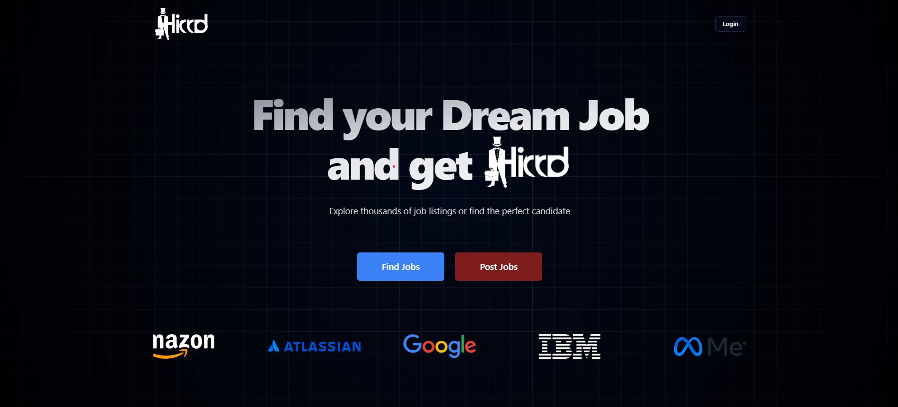

# 🧑‍💼 Job Portal

A modern job portal built using **React**, **Supabase**, and **Clerk** for user authentication. This platform allows users to browse, apply, and manage job listings seamlessly.

---

## 🚀 Tech Stack

- ⚛️ React (Frontend)
- 🧱 Supabase (Backend - Database & Storage)
- 🔐 Clerk (Authentication)

---

## 🛠️ Getting Started

### Prerequisites

- Node.js (v16 or later)
- NPM

### Installation

1. **Clone the repository**
   ```bash
   git clone https://github.com/your-username/job-portal.git
   cd job-portal
2. **Install dependencies** - `npm install`
3. **Create a .env file in the root directory with the following content** - `VITE_SUPABASE_URL=your_supabase_url
VITE_SUPABASE_ANON_KEY=your_supabase_anon_key
VITE_CLERK_PUBLISHABLE_KEY=your_clerk_key
`
4. **Start the application** - `npm run dev`


